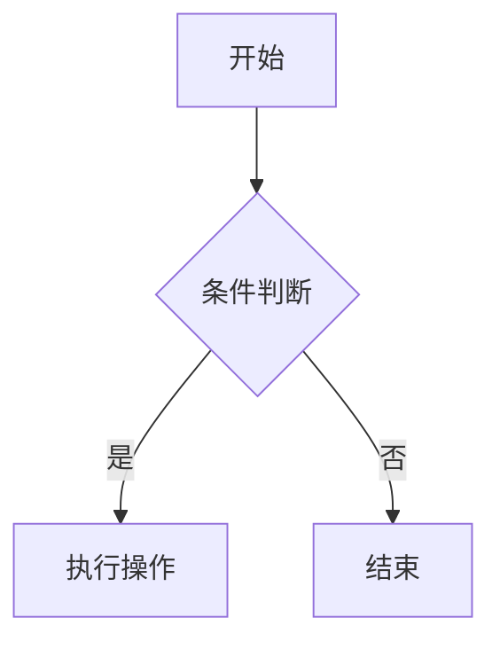

# 一、基础语法
## 1. 标题层级
```
# 一级标题        
## 二级标题       
### 三级标题      
#### 四级标题     
##### 五级标题    
###### 六级标题   
注：部分平台（如GitHub）建议标题上下保留空行6
```
## 2. 段落与换行
直接书写段落文本（无需特殊符号）
行尾添加两个空格后回车实现换行
## 3. 文本格式
*斜体* 或 _斜体_          
**粗体** 或 __粗体__    
***粗斜体*** 或 ___粗斜体___  
~~删除线~~             
==高亮==（部分平台支持）
## 4. 列表系统
- 无序列表项（符号可用-/*/+）
1.  
   - 嵌套列表（缩进2-4空格）
   
- [x] 任务完成项          
- [ ] 待办项            
## 5. 链接与媒体
[内联链接](https://example.com "悬停提示")
           
 （HTML扩展）
# 二、结构化语法
1. 代码块
```python
print("Python代码块")   
```
`行内代码`              
1. 表格系统
| 左对齐 | 居中对齐 | 右对齐 |
| :----- | :------: | -----: |
| 数据1  |   数据2  |   数据3 |
1. 引用与注释
> 一级引用               

这是需要注释的内容[1]
[1]: 脚注说明           
# 三、高级语法
1. 数学公式（需LaTeX支持）
行内公式：$E=mc^2$       

独立公式块：
```math
\int_{a}^{b} x^2 dx    
```
#### 2. 流程图（Mermaid语法）



#### 3. 文档自动化
```markdown
[TOC] 自动生成目录（Typora等工具支持）
          
```

---

# 四、专业技巧
1. **转义处理**：用反斜杠显示特殊符号（如`\*`显示*）
2. **兼容性建议**：重要文档需测试不同平台渲染效果
3. **混合排版**：复杂布局可嵌入HTML标签（如`<div>`）
4. **版本控制**：结合Git管理文档变更历史

---

## 引用来源
[1]: 网页1：Markdown写作指南-CSDN博客  
[2]: 网页2：Markdown 使用教程  
[3]: 网页3：Markdown 格式详解  
[4]: 网页4：Markdown 语法结构教程  
[5]: 网页5：探索 Markdown 的奇妙世界  
: 网页6：程序员必备：Markdown文件编写技巧全分享  
[7]: 网页7：Markdown轻量级标记语言-CSDN博客  

通过系统掌握这些语句规则，可快速构建结构化技术文档。建议使用VS Code+Markdown All in One插件